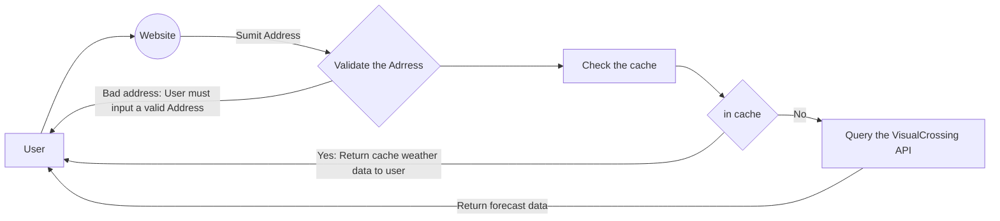
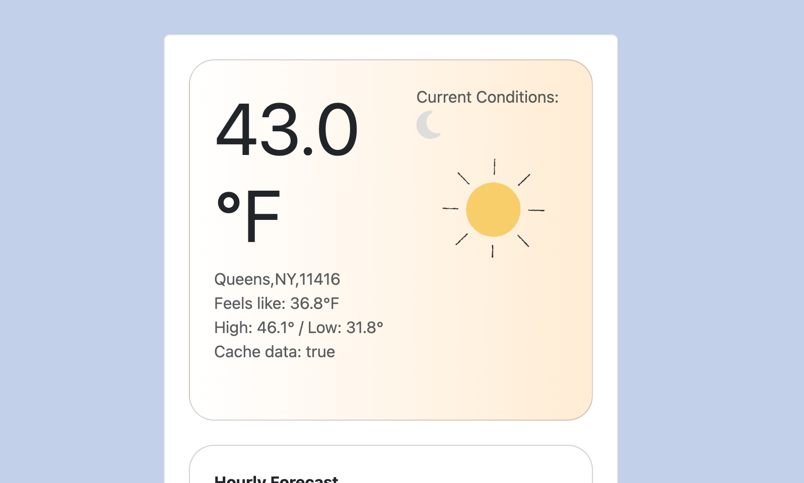
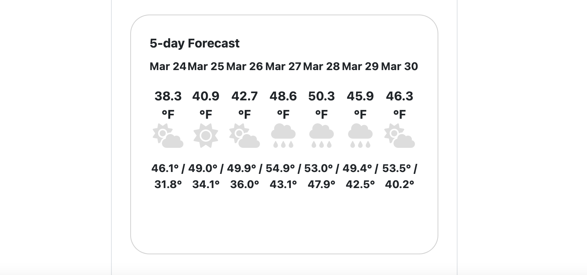

# Welcome to the Weather Service!

A weather forecast is a scientific estimate of the future weather at a given place and time. Weather forecasts are made by collecting data about the current state of the atmosphere, land, and ocean, and using meteorology to project how the atmosphere will change.

This is a simple web application where users can check the weather forecast based on location using Ruby on Rails.


## Tech Stack

For this web application we will be using the following tech stack:

|     Tech           | Description                   
|----------------|-------------------------------
| Ruby On Rails    |`Framework Version 7.1.3.2.`             |
| Ruby          |`programing language and backend service version 3.0.0.` 
| JavaScritpt and CSS          |`frontend.`|
| Redis|  `In memory storage` |
| VisualCrossing     | `API to query weather data`  |

## Features
* Must be done in Ruby on Rails
*  Accept an address as input
*  Retrieve forecast data for the given address. This should include, at minimum, the current temperature (Bonus points - Retrieve high/low and/or extended forecast).
* Display the requested forecast details to the user.
* Cache the forecast details for 30 minutes for all subsequent requests by zip codes.
* Display indicator if result is pulled from cache.
## Workflow

This is how it should work:



# Setup

We need to setup our tech stack 

## Installing Rails

I recommend to use the following guide: https://gorails.com/setup/macos/12-monterey#ruby


#### Install Homebrew: 

```bash
/bin/bash -c "$(curl -fsSL https://raw.githubusercontent.com/Homebrew/install/HEAD/install.sh)"
```

####  Installing Ruby

brew install rbenv ruby-build # Add rbenv to bash so that it loads every time you open a terminal :
```bash
 echo  'if which rbenv > /dev/null; then eval "$(rbenv init -)"; fi' >> ~/.zshrc source ~/.zshrc
rbenv install 3.3.0 
rbenv global 3.3.0
```

#### Installing Rails


```bash
gem install rails -v 7.1.3
rbenv rehash
```

#### Install Redis

```bash
brew install redis
```

#### VisualCrossing
Visual Crossing Weather is the easiest-to-use and lowest-cost source for historical and forecast weather data. The [Weather API](https://www.visualcrossing.com/weather-api "Visual Crossing Weather API") is designed to integrate easily into any app or code, and our prices are lower than any other provider in the industry.

Please create an account and get the API keys if you want to use this web app.

NOTE: For the purpose of the interview tasks, the current API keys are provided in the email. or in this URL: <URL>

After getting the API keys, you have to set the ENV variables. There is a file in the root directory named `.env.development`, open the file and add:
```bash
VISUALCROSSING_API_URL="https://weather.visualcrossing.com/VisualCrossingWebServices/rest/services/timeline/"
VISUALCROSSING_API_KEY="<YOUR API KEY>"
```
Remember ENV variables need to be in ""

# Github

```bash
git clone https://github.com/Noaj/<NAMEOF THE PROJECT>.git
```

# Start the project

Once your you had setup the tech stack and clone the repository, we need to start the project.

#### Rails Server
To start the Rails serve, in your terminal run: 
```bash
rails s
```
#### Redis Server
To start redis, in another terminal, run
```bash
redis-server
```

# Run tests
```bash
rails test
```

# Screenshots




# Future improvements
Some of the things we have to do in order to make the app better is:
* Improvement of the UI: A more user friendly UI is best for user retention, specially with weather animation.
* Store API data in a in-house database to keep historical record.
* Add an account feature for future users, where they can keep track of historical data and if a zipcode is provided, a notification for the weather based on that zipcode.